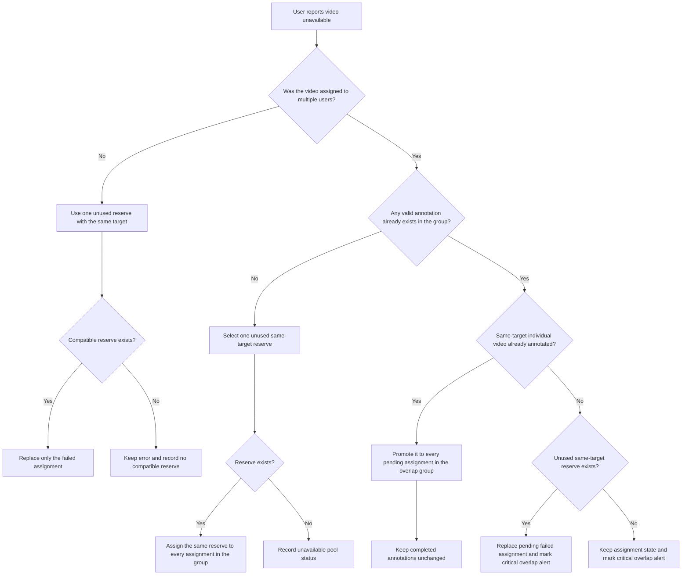

# TokStance! A Open-Source Multimodal Stance Annotation Framework

TokStance! is an open-source Gradio framework for collaborative stance annotation of TikTok videos. Annotators classify the creator's position in relation to a target while considering the post description, transcription, audio, visual elements, and context.

The framework is intentionally adaptable. You can add or remove input features, change the annotation task, replace or extend the label options, customize the assignment policy, and adapt the persistence layer to the needs of your study.

## Features

- Separate administrator and annotator access.
- Official TikTok player using the `player/v1` endpoint.
- Optional video description and audio transcription displayed beside the player.
- Assignment of every video with configurable overlap.
- Versioned assignments with stable `assignment_version` and `assignment_id` values.
- Assignment regeneration when the dataset or assignment configuration changes.
- Progress recovery between sessions, including videos reported as unavailable.
- Replacement of unavailable videos from `data/videos_reserva.csv`, preserving the number of assignment slots.
- Configurable stance labels. The default labels are `Contra`, `A Favor`, `Neutro`, and `Vídeo não relacionado ao target`.
- Administrator dashboard with assignment auditing, agreement metrics, duration alerts, and downloads.
- Administrative command center with operational KPIs, target distribution charts, workload comparison, and preventive action signals.
- Alerts for analyses more than five seconds shorter than the video duration.
- Ordinal Krippendorff's alpha for videos with multiple annotations.
- Local CSV and JSON persistence, suitable for prototypes and small studies.
## Usage and Workflow

1. An authorized user enters an identifier.
2. An administrator configures annotators, task text, and overlap percentage.
3. The application assigns every video: the overlap portion is assigned to every annotator and the remaining videos are distributed in round-robin order.
4. The annotator selects a label or reports that the video did not load.
5. A normal annotation is saved with `assignment_version`, `assignment_id`, video duration, and analysis time. An unavailable-video report is saved in the error log with the original assignment identity.
6. When an error is reported, the application first treats all assignments of the same original video as one overlap group. If no member has been annotated, one same-target reserve is assigned to every member of that group. The error row records the replacement, and all affected annotators see the same reserve video.
7. If one member of the overlap was already annotated, the application first tries to preserve the overlap by promoting a same-target video that was individually assigned and already annotated to every pending assignment in the affected group. This changes which video is in the overlap sample while preserving the overlap percentage and does not rewrite completed annotations.
8. Only when those valid rearrangements are impossible does the application use a same-target reserve for the failed slot and mark `CRITICO_OVERLAP_INCONSISTENTE`; the administrator dashboard displays a critical alert for review.
9. When the annotator returns, the application reads both annotation and error records and opens the first pending assignment while keeping the original queue total.
Unavailable-video handling is a controlled exception to the original assignment plan. It is used only when a video cannot be annotated and only after checking the original assignment group, completed annotations, target compatibility, and available reserve videos. The application never changes a completed result, never replaces a video with another target, and records every decision in `data/erros_videos.csv`.

The normal rule is to preserve the original overlap group. A same-target reserve is shared by all affected pending assignments in that group; it is not counted as multiple reserve videos. If the event order makes exact preservation impossible, the application records a critical status for administrative review instead of silently presenting the change as if it were part of the original sample.

### Unavailable Video Replacement

The replacement logic treats the original video and all of its assignments as one overlap group. A replacement never changes the target: reserve candidates and promoted individual videos must have the same normalized `target` as the failed assignment.



In the promotion branch, the already annotated individual video remains with its original annotator and is copied only into pending slots of the affected overlap group. The completed annotation is never rewritten, and the original failed overlap video is not assigned again to users whose pending slot was promoted. This preserves the configured number of overlap videos as far as the observed data allows, while the administrator is explicitly warned whenever the event order makes exact preservation impossible.

### Assignment Rules

For `N` videos and overlap percentage `p`, the number of shared videos is `floor(N * p / 100)`. The remaining videos receive one assignment each. For example, 36 videos with 50% overlap and two annotators produce 18 shared videos, 18 single-annotator videos, and 54 total assignments, with 27 assignments per annotator.

Assignments use a deterministic target-balanced policy. Videos are interleaved across target groups before selecting the overlap portion and distributing individual assignments, so the allocation does not simply follow the order in `videos.csv`. After allocation, each annotator's queue is sorted into contiguous target blocks. This balances target coverage while avoiding constant target switching during annotation. When the target changes in the interface, the target banner above the video receives a brief visual highlight.

## Assignment Management and Versioning

Assignments are versioned from the ordered dataset and assignment configuration. A version changes when relevant input changes, including:

- video IDs, URLs, or targets;
- the annotator list;
- the overlap percentage.

The current version is written to `data/atribuicoes.csv`. Each row contains an `assignment_version` and an `assignment_id` in the form:

```text
<assignment_version>:<labeler>:<video_id>
```

This prevents annotations from an old dataset or old assignment configuration from incorrectly completing assignments in a new round. Existing result and error files remain available for audit, while the current assignment version defines the active queue.

### Rebuilding Assignments Safely

To start a new assignment round, change at least one input that defines the assignment version, such as the video dataset, annotator list, or overlap percentage. Then:

1. Prepare the new `data/videos.csv` and review its order and IDs.
2. Update annotators or overlap in `data/configuracao.json`, or use the administrator panel.
3. Save the changed configuration or restart the application after changing the inputs. The new version is generated because the dataset or assignment configuration changed, not because the application restarted.
4. Review `data/atribuicoes.csv` and confirm its `assignment_version`, row count, and per-annotator distribution.
5. Keep previous results as historical data. Do not delete them unless the study protocol explicitly requires it.

Restarting the application with the same `videos.csv` and assignment configuration does not create a new round. The assignment version and assignment IDs remain the same, and the existing manifest is reused. This allows the application to recover the current queues without invalidating annotations already collected.

For a major study round, keep an external snapshot of the input dataset, configuration, assignments, results, and errors together with the assignment version.

## Data Files

### Input File Schema

Both required input files, `data/videos.csv` and `data/videos_reserva.csv`, use the same schema:

| Column | Requirement | Description |
| --- | --- | --- |
| `id` | Required | Unique video identifier. |
| `url` | Required | Public TikTok URL used by the player. |
| `target` | Required | Topic, claim, or entity used as the annotation target. |
| `video_description` | Optional | Description or caption published by the creator. |
| `voice_to_text` | Optional | Audio transcription; it may contain recognition errors. |
| `video_duration` | Optional | Duration in seconds, used for analysis-time alerts when available. |

Each file must contain the header and at least one data row. The application aborts before opening the interface if either file is missing, malformed, empty, or has no data rows.

Example primary input:

```csv
id,url,target,video_description,voice_to_text,video_duration
1234567890123456789,https://www.tiktok.com/@creator/video/1234567890123456789,example target,Post description,Audio transcription,30
```

Example reserve input:

```csv
id,url,target,video_description,voice_to_text,video_duration
reserve-001,https://www.tiktok.com/@creator/video/reserve-001,example target,,,30
```

Optional columns may be absent. In that case, the interface displays an appropriate unavailable message and the rest of the annotation flow continues.

`videos_reserva.csv` contains fallback videos used when an annotator reports an unavailable video. Reserve videos must follow the same schema and target-compatibility rules described in [Unavailable Video Replacement](#unavailable-video-replacement).

### Data Directory

The application reads data from `data/` by default. For deployments or tests that keep data elsewhere, set `TOKSTANCE_DATA_DIR` to a directory containing both required input files and, optionally, `configuracao.json`:

```bash
TOKSTANCE_DATA_DIR=/secure/tokstance-data python3 src/app.py
```

The player requires internet access in the annotator's browser. A video that does not load can be reported in the interface; that event is persisted and counts toward progress recovery.

### Input and Configuration

These files may contain research data, URLs, user identifiers, annotations, configuration, or access logs. They are local runtime files and are listed in `.gitignore`. Do not publish or share them without authorization.

- `data/configuracao.json`: JSON configuration template containing `admins`, `labelers`, `videos_per_labeler`, `overlap_percent`, and `tarefa`. `videos_per_labeler` is calculated from the active assignment set and should not be treated as the primary assignment control.

Example configuration:

```json
{
  "admins": ["admin"],
  "labelers": ["annotator-1", "annotator-2"],
  "videos_per_labeler": 0,
  "overlap_percent": 50.0,
  "tarefa": "Detecção de Posição"
}
```

### Generated Assignment and Annotation Files

- `data/atribuicoes.csv`: current assignment manifest. It contains `assignment_version`, `assignment_id`, `labeler`, `video_id`, `url`, `target`, optional feature fields, and `video_duration`. It is regenerated from the current dataset and configuration.
- `data/resultados_anotacao.csv`: normal annotation records. Template columns are `timestamp,labeler,video_id,url,target,stance,tempo_analise_segundos,video_duration,assignment_id`. The application migrates legacy rows when possible.
- `data/erros_videos.csv`: unavailable-video records. Template columns are `timestamp,video_id,url,labeler,assignment_id,replacement_video_id,replacement_url,replacement_assignment_id,replacement_status`. Legacy four-column rows are also read for compatibility. `replacement_status` can be `SUBSTITUIDO_OVERLAP` for a shared same-target replacement, `SUBSTITUIDO_OVERLAP_REBALANCEADO` for a scientifically valid reassignment using an already annotated individual video, `CRITICO_OVERLAP_INCONSISTENTE` when neither approach can preserve the overlap, `SEM_RESERVA_DISPONIVEL` when the pool was exhausted, or `SEM_RESERVA_COMPATIVEL` when available reserves have another target.
- `data/acessos_log.csv`: access and timing events with `timestamp,usuario,acao,tempo_desde_login_segundos`.
- `data/concordancia.json`: generated report containing the agreement metric, comparable videos, discordant videos, and annotators with the highest disagreement.

## Administration and Analytics

The administrator dashboard is read-only. Configuration and assignment generation remain external to the interface; the dashboard lets administrators select an assignment round and inspect its data.

The disagreement analysis uses the following explicit distance matrix:

| Pair of labels | Distance / penalty |
| --- | ---: |
| Same label | 0 |
| `Contra` vs. `Neutro` | 1 |
| `Neutro` vs. `A Favor` | 1 |
| `Contra` vs. `A Favor` | 4 |
| `Vídeo não relacionado ao target` vs. any stance | 3 |

The video score is the mean pairwise distance between annotations for that video. The annotator penalty is the sum of each annotator's mean distance to the other annotations on the same videos. Therefore, a polar disagreement between `Contra` and `A Favor` is penalized more heavily than a disagreement involving `Neutro`. The dashboard ranks annotators with the highest accumulated penalty and videos with the highest weighted divergence.

The dashboard also includes visual summaries of:

- assignment progress by annotator, including completed and pending videos;
- weighted disagreement by annotator and video;
- logins per day;
- number of active days per annotator;
- average session time based on the access log.

The test suite creates a small synthetic dataset and configuration in `tests/.test-data/` through `tests/conftest.py`. These fixtures are intentionally fake and are ignored by Git; the real `videos.csv` and runtime data are never required by CI.

## Local Development

```bash
python3 -m venv venv
source venv/bin/activate
pip install -r requirements.txt
python3 src/app.py
```

Open the URL printed by Gradio. The default port is `7860`. If the port is already in use, set `GRADIO_SERVER_PORT` or change `server_port` in `src/app.py`.

### Running with tmux

Use `tmux` to keep the application running after disconnecting from the terminal:

```bash
# Create and enter a named session
tmux new -s sessao-teste

# Activate the environment and start the application inside the session
source venv/bin/activate
python3 src/app.py

# Detach from the session while leaving the application running
# Press Ctrl-b, then d

# Reattach to the session later
tmux attach -t sessao-teste

# Stop the session and the application running inside it
tmux kill-session -t sessao-teste
```

Run `tmux attach` before `tmux kill-session` when you need to inspect the running application. After a session is killed, it can no longer be attached.

## Testing

The repository separates tests by scope:

```text
tests/
├── unit/        # assignment math and versioning
├── integration/ # persistence and progress recovery
└── system/      # application/interface contracts
```

### Unit tests

Unit tests in `tests/unit/` validate deterministic assignment logic without opening the web interface. They verify:

- all videos are covered;
- overlap produces the expected number of shared assignments;
- workload is balanced between annotators;
- a changed dataset creates a new `assignment_version` and new assignment IDs.
```bash
pytest -q tests/unit
```

### Integration tests

Integration tests in `tests/integration/` validate behavior across assignment generation and persistence data. They verify:

- results from an old assignment version do not complete a current assignment;
- a normal annotation resumes at the first current pending assignment;
- an unavailable-video record counts as completed for the current assignment.

```bash
pytest -q tests/integration
```

### System tests

System tests in `tests/system/` validate the application-facing contract without requiring an external TikTok login or a live production server. They verify that:

- the labeler queue can be constructed from the configured dataset;
- the video HTML uses the official TikTok player endpoint;
- description, transcription, assignment version, progress, and target question are exposed to the interface.

```bash
pytest -q tests/system
```

### Full suite

Run compilation and all tests with:

```bash
python3 -m py_compile src/app.py
pytest -q
```

`pytest.ini` adds the repository root to the Python path and restricts discovery to `tests/`.

### Continuous Integration

`.github/workflows/ci.yml` runs automatically on every `push` and `pull_request`. The workflow tests Python `3.10`, `3.11`, and `3.12`, installs `requirements.txt`, compiles `src/app.py`, and runs the full pytest suite. A commit or pull request is considered healthy only when all matrix jobs pass.

## Deployment

The framework can be deployed to any hosting service compatible with Python and Gradio, including managed application platforms, containers, virtual machines, or institutional infrastructure. The hosting choice is intentionally left to the project owner.

Regardless of the provider:

1. Install the dependencies in `requirements.txt`.
2. Expose the application on the provider's host and port.
3. Provide `data/videos.csv` and `data/configuracao.json` through protected deployment storage, or set `TOKSTANCE_DATA_DIR` to the protected data directory.
4. Use persistent storage for generated CSV and JSON files.
5. Restrict administrator downloads and protect the annotation data.
6. Configure HTTPS, authentication, backups, monitoring, and retention according to the research protocol.

For long-running or concurrent production use, replace local CSV/JSON persistence with a transactional database and object storage, or implement a provider-specific persistence adapter.

## Project Structure

```text
.
├── src/
│   ├── __init__.py            # source package marker
│   └── app.py                 # Gradio application and annotation logic
├── requirements.txt          # Python dependencies
├── pytest.ini                # pytest import path and discovery configuration
├── README.md                 # Project documentation
├── .github/
│   └── workflows/
│       └── ci.yml            # GitHub Actions test workflow on push and PR
├── tests/
│   ├── unit/                 # assignment math and versioning tests
│   ├── integration/          # persistence and progress recovery tests
│   └── system/               # application/interface contract tests
├── data/
│   ├── videos.csv            # sensitive input, ignored by Git
│   ├── configuracao.json     # sensitive configuration, ignored by Git
│   ├── atribuicoes.csv       # generated assignment manifest, ignored by Git
│   ├── resultados_anotacao.csv # generated annotations, ignored by Git
│   ├── erros_videos.csv      # generated unavailable-video records, ignored by Git
│   ├── acessos_log.csv       # generated access logs, ignored by Git
│   └── concordancia.json     # generated agreement report, ignored by Git
```

## Security and Operations

- The framework is open source, but research data remains the responsibility of the study owner.
- `.gitignore` prevents new local data files from being added to Git. It does not erase sensitive files from Git history.
- Remove already tracked sensitive files from the index deliberately with `git rm --cached <file>` after confirming the impact.
- Do not store credentials, real participant names, or un-anonymized research data in the repository.
- Keep external snapshots of each dataset and assignment version for reproducibility.
- Download results regularly and maintain protected backups according to the study protocol and applicable privacy requirements.
